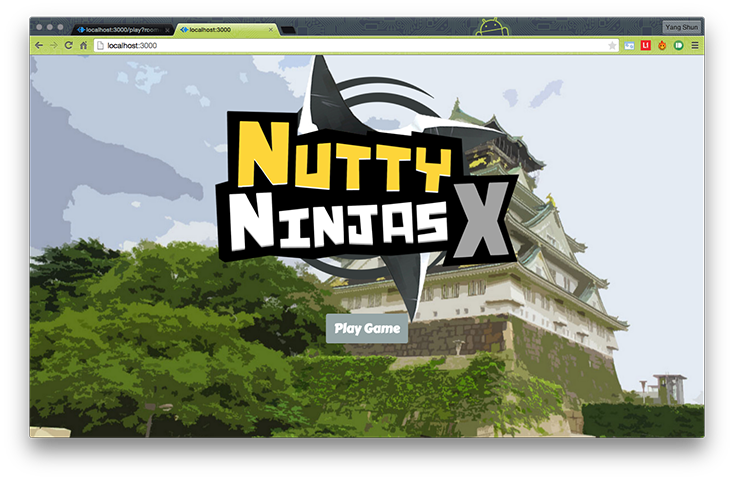
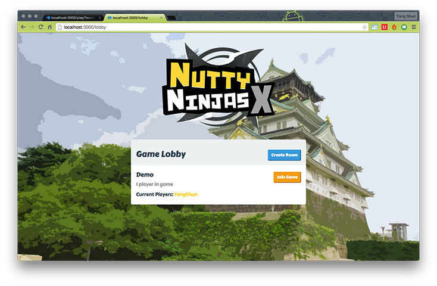
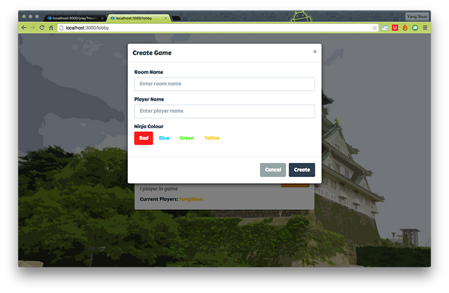

Nutty Ninjas X
======

### Introduction

The secrets of a ninja's teleportation skills have finally been revealed! Ninjas create a pair of inter-spatial portals which allow objects to travel through them. Nutty Ninjas X is a sequel to the hit game Nutty Ninjas, and it makes use of this portal mechanics to add a new twist to the original game. In this fast-paced sequel, ninjas battle against each other in a test of wits and reaction skills by eliminating as many opponents as they can while trying to stay alive.

### Installation

To set up, please do the following:

Install the node packages:
```
$ npm install
```

Install bower dependencies. [Bower](http://bower.io/) is a package manager for front-end JavaScript libraries/frameworks. Bower packages will be installed in `public/bower_components`.
```
$ npm install -g bower
$ bower install
```

Run the node server.
```
$ node index.js
```

### Playing the Game

##### Starting the Game



1. Go to `http://localhost:3000/` in a browser to view the game. Preferably Chrome browser.
2. Click on **Play Game** to view the lobby screen.

##### Lobby



In the lobby screen, existing rooms running the games are shown. Players can either create their own room via the **Create Room** button or click the **Join Game** button to join an existing game.



Players have to fill in a **Player Name** and select a **Ninja colour** before they can start playing.

##### Game

**Controls**

Use the buttons <kbd>W</kbd>, <kbd>A</kbd>, <kbd>S</kbd>, <kbd>D</kbd> to move the player around. <kbd>E</kbd> is used to toggle between Shuriken mode and Portal mode.

Click on anywhere in the screen to fire the shuriken/portal projectile in that direction. Portals will spawn on the location that is being clicked.

**Portals**

Portals have the ability to teleport objects. Both players and shurikens can be teleported between portals. Each player can only have a pair of portals existing in the game at any one time. Subsequent portals fired will replace existing created portals. If there is only one portal existing in the game, then the portal does not teleport objects.
